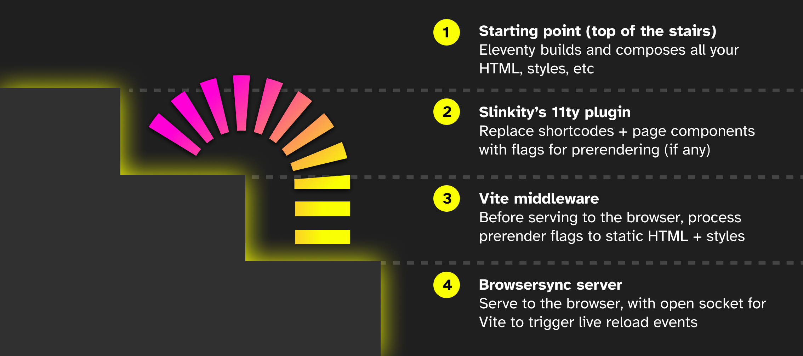

# Architecture of Slinkity core 🏰

## Understanding the CLI

When you run the `slinkity` command, what happens?

1. **All arguments are parsed**. These arguments closely mirror those of Eleventy's CLI command to make onboarding as seemless as possible - src/cli/index.js

All args are passed directly to Eleventy with 2 exceptions:
- `serve` - this starts Eleventy in `--watch` mode instead, so Slinkity can spin up an independent Vite server instead of 11ty's Browsersync server ([see here](src/cli/index.js#L69-L71))
- `port` - since we use our own server, we'll need to pick up and pass this port to Vite as well

2. **Check for any Eleventy configs in your project**. If we find one, we'll look for any custom directories you've returned (input, output, etc). We'll pass these off to the Vite server so it can look in the right place.

### When using the dev server

We start 2 dev servers in parallel here: an Eleventy server to build your templates and watch for file changes, and a Vite server for resource bundling and debugging in your browser.

3. **Start the Vite server pointing to your Eleventy output directory.** If that directory doesn't exist yet, fear not! Vite patiently waits for the directory to get written 😁 - `src/cli/vite.js`
4. **Start Eleventy in `--watch` mode with our custom Slinkity config applied.** Note users _don't_ have to import and apply Slinkity as a plugin directly! Instead, we send our own config file to 11ty with our plugin applied ([see slinkityConfig](src/cli/slinkityConfig.js)), and nest the user's Eleventy config (if any) inside of this. Just adds some extra [DX](https://www.netlify.com/blog/2021/01/06/developer-experience-at-netlify/) spice 🌶 - `src/cli/eleventy.js`

### When performing production builds

For production builds, we'll run Eleventy and Vite one-after-the-other. Eleventy takes care of building all your routes, and Vite picks up all the resource bundling, minification, and final optimizations.

3. **Build your project using Eleventy to a temporary directory.** Since we're using a 2-step build process, we can't build your routes to the _final_ output directory just yet! We need to make a temporary bucket for Vite to pull from.
4. **Build from this temporary directory to your intended output using Vite.** We [use a glob to find all the routes in your app](src/cli/vite.js#L39-L58). Otherwise, we don't mess with Vite's defaults too much.

## Understanding our Eleventy plugin

Let's say you save a change to a `template.html` in your project, and that template contains a React component shortcode. What does our plugin do?

### First, our shortcode definition

This statically renders components to plain HTML and CSS, and sets the stage for hydration later on. Note that page-level components have a _very_ similar definition to these shortcodes!

1. **Your `react` shortcode gets picked up by [our shortcode definition](src/plugin/reactPlugin/1-pluginDefinitions/addShortcode.js#L28-L37).** This reads in any arguments passed as props to a set of key / value pairs.
2. **The specified component gets built to a node-friendly module** using [Vite SSR](https://vitejs.dev/guide/ssr). This lets us grab the component definition itself for statically rendering to the document.
3. **We store any important attributes for that component** (props, hydration mode, processed CSS-in-JS styles, source template path) for later processing. We'll get back to [this componentAttrStore](src/plugin/reactPlugin/2-pageTransform/componentAttrStore.js) in the next section!
4. **We turn your component into static HTML** ([see here](src/plugin/reactPlugin/1-pluginDefinitions/toRendererHtml.js)) and return this from the shortcode. Remember, shortcodes are find-and-replace functions that take in arguments and spit out markup for the page. We'll also wrap your static HTML in a "mount point" if you need some JavaScript hydrated on the client. These serve as the root for React, Vue, or Svelte to generate their component trees.

### Then, our HTML transform

This generates all the load `scripts` for hydration on the client, and inline `styles` for CSS-in-JS ([see here](src/plugin/reactPlugin/2-pageTransform/toHydrationLoadersApplied.js)). This is applied using Eleventy's [transform build hook](https://www.11ty.dev/docs/config/#transforms), which lets us modify the `.html` output of any template before it's built.

1. **We read all the components from our store** to figure out which hydration loaders to apply ([see here](src/plugin/reactPlugin/index.js)).
2. **We copy any hydrated components to the build output** so Vite can find them later. Yes, we plan to abandon this copying model in the future for better performance.
3. **We apply the appropriate hydration script** depending on [the hydration mode](https://slinkity.dev/docs/partial-hydration/) you set. In your browser, these loaders pull from the `_client` directory using Vite. It's worth checking out the [loader script file](src/plugin/reactPlugin/2-pageTransform/toLoaderScript.js) to see how this works! It's the bread-and-butter of our islands architecture setup 🏝
4. **We stringify any CSS modules or CSS-in-JS** for each component into one big `style` tag. Note that we use a key / value store mapping the source file for that CSS (ex. `styles.module.css`) to its associated styles. This allows for easy de-duping as we merge the styles for all components on the page.
5. **We insert all the styles and scripts** to the end of your templates `<body>`.